# Ultra-smart dashboard delivery plan

## Product outcome

DashboardOS should turn an approved database scope and one natural-language brief into a healthy published dashboard, let each entitled client create a personalized chart view without mutating the published release, and generate evidence-bound reports from natural-language requirements.

The AI is a planner and explainer. DashboardOS remains the query executor, validator, entitlement boundary, release manager, and audit system.

## Current reality

### Working foundations

- Project Autopilot discovers the selected schema, produces an approved semantic model, publishes a governed dataset, creates validated chart configs, composes an idempotent responsive dashboard, and can automatically finalize a healthy immutable release.
- Immutable dashboard publishing, release snapshots, rollback, dashboard health checks, chart execution, export artifacts, background jobs, tenant capabilities, and dashboard entitlements already exist.
- Autopilot publication supports `review_required` and `auto_publish_when_healthy`, with resumable release finalization and post-release verification.
- The client chart runtime already includes a basic `All charts / one chart` selector.
- `ReportSpec.v1`, governed report-outline generation, deterministic fallback, proposal persistence, and fact-citation validation already exist.
- Generated semantic models are invalidated when their materialized source-column context no longer matches the current selected schema.
- The bounded 80-column semantic context is role-prioritized and balanced across all selected tables instead of truncating the first 80 discovered columns.
- Chart proposals now satisfy each template's projected dimension contract before governed validation.
- The release slice is green under TypeScript, targeted ESLint, production build, and 37 focused Autopilot, readiness, immutable-release, and integrity tests.

### Blocking gaps

1. The client selector is transient, single-select, and loads every chart even when only one is visible.
2. There is no persisted personal/shared dashboard-view model.
3. Natural-language analysis is mounted on released dashboards and resolves governed metric and dimension IDs, but it is still limited to 50 released preview rows rather than full dataset execution.
4. The governed report proposal API has no report-builder UI and currently has zero computed facts.
5. The legacy report agent accepts raw widget payloads and is disconnected from `ReportSpec.v1`, release snapshots, deterministic facts, and export artifacts.
6. Existing PDF export is primarily a release inventory; it does not render an evidence-bound report from `ReportSpec.v1`.
7. Supabase migration history is not reconciled: 42 local-only and 10 remote-only versions currently block automated schema deployment.

## Database adaptation pipeline

The schema itself is structured evidence, so it remains authoritative. Vector retrieval is an optional enrichment layer, not the mechanism that decides what tables or columns exist.

1. Introspect the selected schemas and persist a stable schema hash plus table, column, key, sensitivity, and join evidence.
2. Compare the current selected-column context with the generated model's materialized source context.
3. Reuse the generated model only on an exact context match; otherwise start a new model version.
4. Select bounded semantic context by business role while preserving coverage across every selected table.
5. Propose entities, fields, metrics, and joins; validate every source reference and auto-approve only source-valid generated models.
6. Publish a governed dataset from approved semantic IDs.
7. Generate chart candidates from template contracts, validate each projected encoding, and persist the suite atomically.
8. Compose, audit, checkpoint, publish, and verify the immutable dashboard release.

Retrieval is added later over approved examples: schema-profile summaries, accepted semantic mappings, successful chart suites, and user corrections. Hybrid retrieval can improve naming and ranking, but retrieved examples never override current schema evidence, tenant boundaries, or deterministic validation.

## Target operating flow

```mermaid
flowchart LR
  A["Natural-language project brief"] --> B["Governed Autopilot"]
  B --> C["Validated dashboard draft"]
  C --> D["Readiness and health audit"]
  D -->|"healthy + policy allows"| E["Immutable release publish"]
  D -->|"blocked or review policy"| F["Actionable review"]
  E --> G["Snapshot verification and client smoke test"]
  G --> H["Published client dashboard"]
  H --> I["Personal/shared chart views"]
  H --> J["NLP report requirement"]
  I --> J
  J --> K["ReportSpec proposal"]
  K --> L["Deterministic query and fact execution"]
  L --> M["Citation-bound narrative"]
  M --> N["Preview, refine, PDF export"]
```

## Delivery sequence

### Gate 0 — release and database safety

This gate must close before new production schema is deployed.

- Reconcile local and linked Supabase migration histories on a disposable development branch.
- Prove object-level equivalence for repair migrations; never bulk-mark history as applied.
- Apply genuinely missing DDL as new forward migrations.
- Run RLS, security, and performance advisors plus the migration drift guard.
- Add a bounded verification command so linked migration checks fail quickly with a useful error instead of hanging.

Acceptance:

- `npm run db:migrations:check` passes.
- Local replay and linked development schema are equivalent for release, AI workflow, job, and export objects.
- No warning-level advisor findings are introduced.

### Slice 1 — self-closing governed Autopilot publication

Status: completed on 2026-07-24.

Live proof:

- Autopilot run `1a1f594c-6af5-45f7-a794-5541f6f57706` reached `succeeded` at 100%.
- Dashboard `309e39db-83f6-405a-b91a-774feac14707` now points to published immutable version `abd9352f-cb7b-4048-86e4-e625de7da99b`.
- The release contains one page, six slots, six chart snapshots, one dataset snapshot, a tenant entitlement, and a healthy 6/6 health run.
- The captured source-schema contract matches the active data source.

Add a project/tenant publication policy:

- `review_required`
- `auto_publish_when_healthy`

After dashboard composition, the server orchestration will:

1. Run the existing guided readiness and dashboard health audit.
2. Stop with structured, actionable blockers when health is blocked.
3. Call the existing immutable publish operation when policy permits.
4. Verify page, slot, chart-snapshot, and dataset-snapshot counts.
5. Ensure the default tenant entitlement exists.
6. Execute a bounded smoke query for every released chart.
7. Mark Autopilot succeeded only after the client release is loadable.

All steps must be idempotent and resumable. Retrying a successful publish must return the existing release rather than creating duplicates.

UI changes:

- Replace ambiguous “published chart” wording with `Chart config ready`.
- Show separate `Draft composed`, `Release health`, `Immutable release`, and `Client verified` states.
- Provide one-click remediation links for blocked checks.
- Open the exact published dashboard after successful verification.

Acceptance:

- A healthy demo brief ends with a non-null `current_version_id` and matching immutable snapshots.
- A blocked dashboard remains unpublished and reports the failing chart/slot.
- Refreshing or retrying does not duplicate dashboards, versions, snapshots, or entitlements.
- The client route renders all released charts without manual database intervention.

### Slice 2 — dynamic chart selector and saved views

Upgrade the current single-select dropdown into a responsive chart-view controller:

- Multi-select visible charts.
- Search by chart name, metric, dimension, and chart type.
- `All`, `KPIs`, `Trends`, `Breakdowns`, and `Risks` quick groups.
- Pin, hide, reorder, focus, and reset.
- URL-backed transient selection for shareable navigation.
- Personal saved views and optional tenant-shared views.
- Mobile bottom sheet and accessible keyboard controls.
- Fetch and execute only visible charts; cancel work for hidden charts.

Persist view overrides separately from immutable releases.

Proposed tables:

#### `dashboard_saved_views`

- `id`, `tenant_id`, `project_id`, `dashboard_id`
- `owner_user_id`
- `name`, `visibility` (`personal` or `tenant`)
- `base_version_id`
- `configuration jsonb`
- `is_default`, `created_at`, `updated_at`

`configuration` is server-validated and contains only stable release slot keys, ordering, density, and display overrides. It never contains SQL or unrestricted chart options.

Indexes and controls:

- Unique personal view name per user and dashboard.
- Composite lookup index on `(tenant_id, dashboard_id, owner_user_id, updated_at desc)`.
- Foreign-key indexes on dashboard, version, owner, project, and tenant references.
- RLS for owner writes, entitled reads, and project-editor management of tenant-shared views.
- Explicit authenticated grants; no anonymous mutation.

AI smart-view action:

> “Show billing risks and outage trends for leadership.”

The model may select and order only released slot keys from the current immutable snapshot. A deterministic relevance scorer is the fallback. The server validates every selection before returning or saving it.

Acceptance:

- A user can display any subset, reorder it, save it, reload it, and reset to the publisher layout.
- Another user cannot read or mutate a personal view.
- A view created against an older version reconciles known slot keys and clearly reports removed charts.
- Hidden charts do not trigger chart-run requests.

### Slice 3 — governed NLP report generator

Unify natural-language analysis, `ReportSpec.v1`, deterministic execution, and PDF export into one report workflow.

#### User experience

- Add `Ask AI` and `Create report` actions to the published client dashboard.
- The report drawer accepts purpose, audience, time range, selected saved view, page length, tone, and branding.
- Show an editable outline before execution.
- Allow conversational refinements such as:
  - “Make it executive and limit it to two pages.”
  - “Compare this quarter with last quarter.”
  - “Add an appendix with city-level details.”
- Show evidence and confidence beside every generated claim.
- Support preview, version history, retry, and PDF download.

#### Governed execution pipeline

1. Resolve the current immutable dashboard release and client entitlement.
2. Build a bounded evidence catalog from released dataset snapshots and selected chart slots.
3. Generate and validate a `ReportSpec.v1` proposal.
4. Compile report blocks through the existing governed dataset query compiler.
5. Compute KPI, comparison, trend, anomaly, and table facts deterministically.
6. Store facts with dataset snapshot, query hash, parameters, result hash, row count, and computation time.
7. Give the narrative model facts only—not unrestricted database access or model-authored SQL.
8. Require every narrative claim to cite one or more fact IDs.
9. Strip unsupported claims and fail closed when no valid evidence remains.
10. Render a branded PDF containing charts/tables, footnoted claims, methodology, and evidence appendix.

Proposed persistent model:

- `report_documents`: tenant/project/dashboard ownership and lifecycle.
- `report_versions`: immutable `ReportSpec`, source release, status, validation, and generation metadata.
- `report_facts`: deterministic fact values and provenance.
- Reuse `ai_workflow_runs` and `ai_workflow_proposals` for model planning/audit.
- Reuse `platform_jobs` for `report_generate`.
- Reuse `dashboard_export_artifacts` or a compatible artifact table for final PDF storage and checksums.

API surface:

- `POST /api/client/{tenantSlug}/dashboards/{dashboardId}/reports/propose`
- `POST /api/client/{tenantSlug}/reports/{reportId}/refine`
- `POST /api/client/{tenantSlug}/reports/{reportId}/generate`
- `GET /api/client/{tenantSlug}/reports/{reportId}`
- `POST /api/client/{tenantSlug}/reports/{reportId}/export`

Security:

- Require `client_runtime` for dashboard access and `report_exports` for generation/export.
- Resolve all tenant, project, dashboard, release, dataset, and report IDs server-side.
- Never trust raw widget data submitted by the browser.
- Replace or retire the legacy `/api/agents/report` path after compatibility tests.
- Limit rows, execution time, prompt context, output size, retries, and concurrent jobs.

Acceptance:

- A client can request a report in natural language from a published release.
- Every displayed claim resolves to stored deterministic fact provenance.
- Invented IDs, SQL, metrics, and uncited claims are rejected.
- The same release, spec, and parameters produce stable facts and a traceable artifact.
- PDF generation works from background jobs and survives page refresh.

### Slice 4 — adaptive intelligence and production hardening

- Capture tenant-isolated accepts, edits, rejects, retries, and view usage.
- Retrieve similar approved report structures and chart selections before planning.
- Add golden evaluation sets for chart selection, report planning, fact correctness, citation coverage, tenant isolation, prompt injection, latency, and cost.
- Add provider/model comparison dashboards and per-workflow rollout policies.
- Add operational metrics for publish completion, chart-run failures, report job failures, unsupported-claim rejection, and cost per successful artifact.
- Enable automatic rollout only after quality and security thresholds pass.

No fine-tuning is required initially. Retrieval of approved examples plus deterministic validation should be measured before training is considered.

## Implementation boundaries

- Published release snapshots remain immutable.
- Personal chart selections are overlays, not release mutations.
- Models never emit executable SQL, JavaScript, CSS, or unrestricted chart options.
- Every query runs through the governed compiler with tenant/project/entitlement checks and bounded budgets.
- Every report claim must cite deterministic evidence.
- Every external side effect is idempotent, audited, and resumable.

## Required test matrix

### Unit and contract

- Autopilot policy and state transitions.
- Saved-view schema validation and version reconciliation.
- Chart visibility request deduplication and cancellation.
- ReportSpec refinement and fact-reference validation.
- Deterministic fact calculations and query hashes.

### Database and security

- Cross-tenant denial for views, reports, facts, jobs, and artifacts.
- Owner-only personal-view mutation.
- Entitled tenant-shared view reads.
- Report-export capability enforcement.
- RLS initialization-plan and foreign-key index checks.

### Integration

- Healthy Autopilot to immutable release to client chart execution.
- Blocked Autopilot remains safely unpublished.
- Saved view persists and loads after sign-in.
- NLP proposal to facts to narrative to PDF artifact.
- Job retry and idempotency after partial failure.

### End-to-end

- Desktop and mobile published-dashboard selector.
- Natural-language smart view.
- Report outline editing and refinement.
- Background generation progress and download.
- Accessibility and keyboard navigation.

## Next implementation slice

With Slice 1 closed, proceed in this order:

1. Close Gate 0 migration reconciliation before deploying new saved-view or report tables.
2. Replace the NLP endpoint's browser-supplied preview-row dependency with server-side release, entitlement, dataset, and semantic-asset resolution.
3. Convert validated intent into the existing governed dataset compiler contract; execute only approved metric and dimension IDs with bounded filters, rows, and timeouts.
4. Add explicit follow-up clarification state for ambiguous metric, dimension, filter, and time-range requests.
5. Build Slice 2's client-side multi-select, search, quick groups, URL state, and visible-chart request cancellation without schema changes.
6. Add the saved-view schema, RLS, reconciliation, and persistence after Gate 0 passes.
7. Implement deterministic report facts and citation-bound preview before PDF export, background generation, and artifact history.

## Smart Service milestone status

Completed in the current sprint:

- Project-owned Ponytail rules enforce the smallest correct implementation for future project work.
- Released chart metric and dimension IDs are sent as bounded semantic evidence.
- Questions resolve to `dashboardos.governed-query-intent.v1` before model execution.
- Unknown metrics fail closed with a clarification instead of guessed IDs.
- The client shows the resolved governed intent with the answer.

Next acceptance target:

- A client question executes against the full approved released dataset through the existing query compiler without accepting dataset IDs, SQL, or unrestricted fields from the browser.
